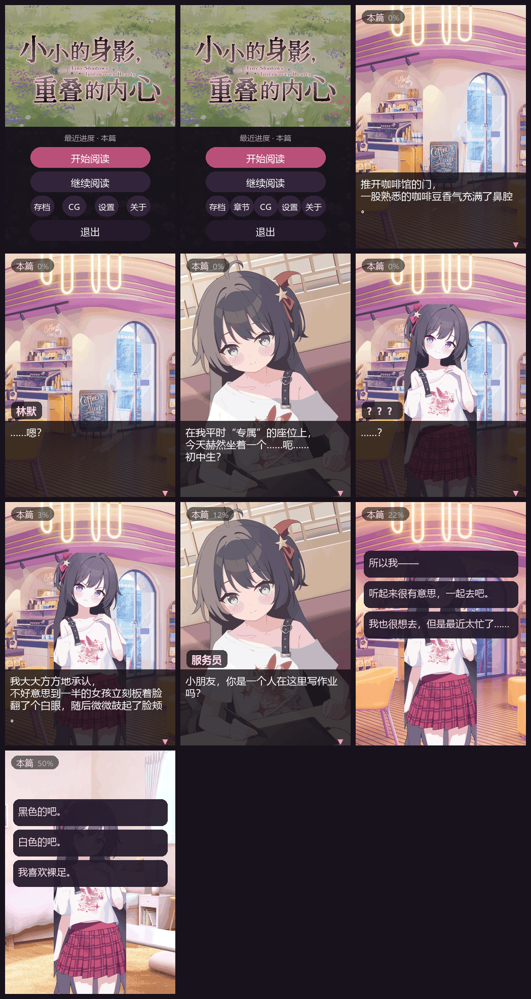

# 小小的身影，重叠的内心 · 小米手环 9 Pro 版

把 PC 版 Ren'Py galgame **《小小的身影，重叠的内心》** 移植成能在**小米手环 9 Pro**（336×480 矩形 AMOLED）上跑的 **Vela 快应用**。

引擎与 UI 直接使用开源工程 [galgod-band](https://github.com/mcpotato1123/galgod-band)（MIT）：**基线 2.2，屏幕常亮取自 2.3**。本工程做的是内容移植（Ren'Py 剧本 / 立绘 / 背景 / CG → galgod 的数据格式）与少量适配。

```
剧本数据  2,677 个节点 / 2 篇 / 21 个分块
对话      2,503 句（全量，非删减）
美术      背景 25（336×480）/ 立绘 94（143×380，含裸足/白丝/黑丝三套差分）
          CG 40（336×480）/ 鉴赏缩略图 8 + 标题画 + 标题 logo + 图标
分支      3 个选择点，2 个结局（真结局 + 一个「擦肩而过」）
CG 鉴赏   8 组 / 31 张差分图，按原作 gallery_screen.rpy 的分组与解锁条件
页面      7 个：主页 / 正文 / 存档 / 章节 / CG 鉴赏 / 设置 / 关于
协议      代码 MIT（见 LICENSE）；剧本与美术资源不在 MIT 范围内（见 NOTICE.md）
产物      dist/com.tinyshadows.band.debug.1.0.0.rpk   5.68 MB
```

> **免责声明**：本项目是非官方的个人移植，仅供学习交流。
> 剧本文字与全部美术资源（背景 / 立绘 / CG）版权归 **《小小的身影，重叠的内心》** 原作及其开发方所有。
> 本仓库出于「可运行」的需要收录了转码后的资源，请不要用于任何商业用途。
> 本仓库内容以“原样”制作，无暗自魔改。
> 本仓库的**代码**部分可自由参考。详见文末「九、版权与开源协议」。

---

## 故事梗概

> 以下为原作设定的简介。

**主要角色**

| 角色 | 简介 |
|---|---|
| **林默**（主角） | 22 岁的社畜。周六下午的咖啡馆里有一个「专属」的座位，习惯一个人待着。 |
| **苏幼晴** | 看起来只是个初中生，实际是网上小有名气的画师兼主播「月染酱」。毒舌，但意外地成熟。 |
| **？？？** | 故事开头那个趴在桌上画画的小小身影。 |

**主线**

一个周六下午，林默在平时「专属」的座位上，遇见了一个趴在桌上用平板画画的小女孩。
一支滚落到脚边的触控笔，让两个人第一次说上了话。

从咖啡馆到漫展，从直播间到日常的一来一往——小小的身影，一点一点重叠进彼此的生活里。

故事分 **本篇** 与 **后日谈** 两部分。本篇里还藏着一个「擦肩而过」的分支：
如果那天没有把笔捡起来，两个人大概就只是陌生人了。

---

## 一、目录结构

```
tinyshadows-band/
├─ package.json              npm 脚本与 aiot-toolkit 依赖
├─ LICENSE                   本项目**代码**的 MIT 协议
├─ NOTICE.md                 素材版权说明（哪些内容不在 MIT 范围内）
├─ PUSH.md                   推到 GitHub 的说明（本机网络受限，见文末）
├─ src/                      快应用源码（Vela 固定目录名）
│  ├─ manifest.json          应用清单：包名/图标/路由/features/designWidth
│  ├─ app.ux                 应用入口（本工程不用全局生命周期）
│  ├─ common/
│  │   ├─ assets.js          ← 生成：图片索引表（剧本里的资源号就是数组下标）
│  │   ├─ cglist.js          ← 生成：CG 鉴赏分组与解锁条件
│  │   ├─ reader.js          公共逻辑：设置项、storage 封装、换行与分页、自动播放时长
│  │   ├─ home.png           标题画（原作 titlenew_bg_1）
│  │   ├─ logo.png           标题 logo（原作 custom/LOGO_white.png）
│  │   ├─ icon.png           应用图标（原作 gui/window_icon.png）
│  │   ├─ img/b/*.png        ← 生成：背景 25 张 336×480
│  │   ├─ img/s/*.png        ← 生成：立绘 94 张 143×380（带透明通道）
│  │   ├─ img/c/*.png        ← 生成：CG / SDCG 40 张 336×480（满屏）
│  │   ├─ img/t/g0..7.png    ← 生成：CG 鉴赏缩略图 8 张 96×54
│  │   └─ story/
│  │       ├─ index.txt      ← 生成：章节表 + 分块表（内容是 JSON，用 .txt 扩展名）
│  │       └─ chunk-000.txt… ← 生成：21 个分块，每块 128 个节点
│  └─ pages/
│      ├─ index/             主页：继续 / 开始 / 存档 / 章节 / CG / 设置 / 关于 / 退出
│      ├─ game/              正文阅读器（引擎核心）
│      ├─ saves/             存档 / 读档（6 个手动槽 + 自动存档）
│      ├─ chapters/          章节选择（2 篇：本篇 / 后日谈）
│      ├─ cg/                CG 鉴赏（8 组，含大图查看）
│      ├─ settings/          设置（字号 / 播放速度 / 自动播放 / 快速播放 / 屏幕常亮）
│      └─ about/             关于（故事梗概 / 版权信息 / 开源协议 + 彩蛋）
└─ tools/
   ├─ build.js               ← galgod 原版：构建前静态检查 + 构建包装 + rpk 内容校验
   ├─ validate_story.py      ← galgod 原版：剧本校验（分块完整性、引用越界、全图可达）
   ├─ test_paginate.js       ← galgod 原版：排版测试（抽取 reader.js/game.ux 的函数原文执行）
   ├─ check_encoding.py      ← galgod 原版：上传前自检（UTF-8 / 误传文件 / README 图片）
   ├─ preview_port.py        用真实资源按 game.ux 的 CSS 数值合成界面效果图
   ├─ audit_stage.py         扫「画面状态与演出对不上」的地方（见第五节坑 5）
   └─ storygen/              内容转换流水线（本工程新写，见第六节）
      ├─ build_output.py       ① 解包原作 .rpa（背景 / 立绘 / CG / 界面素材）
      ├─ rpa_tool.py           RPA 解包器
      ├─ build_galgod_port.py  ③ 转成 galgod 节点格式 + 生成索引表 + 装配工程
      ├─ export_band_script.py 把 Ren'Py AST 编译成扁平指令流
      ├─ compose_sprites.py    按 layeredimage 规则合成立绘
      ├─ extract_script.py     对白与演出导出
      ├─ rpyc_probe.py         .rpyc 读取（含宽松 unpickler）
      ├─ rpyc_dump.py / rpyc_expr.py / scan_original.py   分析原作脚本
      └─ simulate_galgod.mjs   剧情流程模拟器：复刻 game.ux 的语义跑全部路线
```

**仓库里已经带了生成好的剧本与美术资源**（`src/common/story/`、`src/common/img/`），
所以只想改代码的话直接 `npm install && npm run build` 就行，不需要原版游戏。
`tools/storygen/` 是**溯源用**的——它们记录了资源是怎么从原版转出来的。

界面效果预览（`preview/ui-preview.png`，用真实资源按 `game.ux` 的 CSS 数值 1:1 合成）：



---

## 二、构建

```bash
npm install                    # 只有 aiot-toolkit 一个真正的依赖
npm run build                  # → dist/com.tinyshadows.band.debug.1.0.0.rpk
npm run release                # → dist/…release….rpk（需要 sign/ 下的证书）
npm run test                   # 运行时分页测试（字号 14~30 全量）
npm run start                  # 起模拟器预览（需要 AIoT-IDE/模拟器环境）
```

> ⚠️ `aiot` **每次构建都会清空 `dist/`**，所以先构建 debug 再构建 release，
> debug 包会消失。两个都要留的话，构建完一个先把 rpk 挪出 `dist/`。

> ⚠️ **Windows 上构建收尾会报 `EPERM`，退出码是 1，但 rpk 其实已经生成好了。**
> 看到 `✔ 完成` 和 `产物: dist\...rpk` 就是好的，详见第五节坑 1。

`npm run build` 用的是 `tools/build.js` 而不是直接 `aiot build`，原因见第五节。

改完代码想确认没弄坏东西：

```bash
npm run check                  # = validate + test，全绿再提交
npm run audit                  # 画面状态审计（第五节坑 5 / 坑 6 的自动检查）
```

| 命令 | 作用 |
|---|---|
| `npm run build` / `npm run release` | 出 debug / release 包 |
| `npm run check` | 剧本校验 + 运行时分页测试 |
| `npm run validate` | 只跑剧本校验（分块、引用、全图可达） |
| `npm test` | 只跑运行时分页测试（字号 14~30 全量） |
| `npm run audit` | 只跑画面状态审计（立绘跨场景残留等） |
| `npm run gen` | 从解包结果重新生成 `src/` 的内容部分 |
| `npm run preview` | 重新合成 `preview/ui-preview.png` |
| `npm run verify` | 上传前自检（UTF-8 / README 图片） |

从 PC 版原始资源重新生成（需要 Python 3 + Pillow，以及解包工具产出的目录）：

```bash
pip install pillow

python tools/storygen/build_output.py             # ① 解包原作的 .rpa → 原始解包/ 与 解包/
python tools/storygen/build_galgod_port.py        # ③ 生成 src/ 的内容部分
node  tools/storygen/simulate_galgod.mjs .        # 跑一遍全部剧情分支
python tools/validate_story.py .                  # 校验
python tools/preview_port.py .                    # 合成预览图
```

> 这些脚本默认从**仓库上一级**读解包产物（`原始解包/`、`解包/`）和 galgod 参考源码
> （`galgod-band-ref/`、`galgod-band-23/`）。仓库里已经带了生成好的资源，
> **只是改代码的话不需要跑这些脚本**。

---

## 三、安装到手环（以**Astrobox**为例）

`dist/` 里的 **debug rpk 可以直接侧载**，不需要签名证书。

1. 手机装 **Astrobox**
2. 【设置】→【账号与安全】→ 登录小米账号→导入在小米运动健康绑定的设备→下面的请连接设备连接手环
3. 【探索】→ 点 `安装快应用` → 找下载的文件（可能在最近项目里，若没有点**左上角**三个杠<不是**右上角**三个点>找你手机的型号的图标，点开找 Download 或下载的文件夹，里面就有文件了）
4. 等 **Astrobox** 右下角的圆环跑满
5. 手环上会出现 **小小的身影，重叠的内心** 图标

> 官方 FAQ：<https://iot.mi.com/vela/quickapp/zh/guide/other/faq.html>
> 官方真机调试目前只支持 Xiaomi Watch S4，**手环 9 Pro 不在其列**，所以只能走上面这条侧载路径；查看运行日志要用小米运动健康的「拉取固件日志」。

**release 包**需要签名证书，`aiot release` 会报 `there is a problem with the certification path`：

```bash
mkdir sign
openssl req -newkey rsa:2048 -nodes -keyout sign/private.pem -x509 -days 3650 -out sign/certificate.pem
npm run release
```

---

## 四、运行时的设计

> 这一节的机制全部来自 galgod-band（引擎未改），这里记录的是**本工程实际用的那套参数**。

### 屏幕与单位

手环 9 Pro 官方参数：**336×480、矩形屏、1.74″、DPR 2.1、逻辑宽度 168dp**。
`manifest.json` 里 `designWidth: 336`，所以 **1px = 1 物理像素**，所有 CSS 数值直接按像素写，
不需要换算，也不用媒体查询。

### 画面分层

正文页的层序是固定的（`game.ux` 里节点的先后就是层序）：

| 层 | 节点 | 说明 |
|---|---|---|
| 背景 | `.layer` / `.solid` / `.solid-white` | `object-fit: cover` 铺满；纯黑 `-1` / 纯白 `-2` 用两个纯色 div |
| 立绘 | `.sp-l` / `.sp-c` / `.sp-r` | **三个固定槽位**（143×380，`left` 10 / 96 / 182），不做动态节点 |
| CG | `.layer` | 满屏 `cover`；层序上 CG 压住立绘 |
| 回忆滤镜 | `.tint` | 整屏半透明色块 |
| UI | `.hud` / `.panel` / `.ln` / `.choices` / `.end` … | 对白底板、正文 6 个固定槽位、选项、结局 |

Ren'Py 那边是一条**画面栈**（`scene` 清空、`show` 追加），和这里的固定层序不是一回事——
两者的差异正是第五节坑 5 的主题。

### 剧本数据格式

`src/common/story/index.txt` 是章节表 + 分块表，每个 `chunk-NNN.txt` 是 128 个节点的 JSON 数组。
**用 `.txt` 扩展名存 JSON**（原因见第五节坑 2）。节点类型：

| 节点 | 含义 |
|---|---|
| `{"t":"s","n":说话人,"x":文本}` | 对白 |
| `{"t":"o","o":[{"x":选项文字,"j":跳转节点,"c":条件}]}` | 选项。`c` 为 `null` 或 `[变量, 运算符, 值]` |
| `{"t":"j","j":节点号}` | 无条件跳转 |
| `{"t":"cj","v":变量,"op":"==","n":值,"j":节点号}` | **条件跳转**：成立则跳转，否则继续下一条 |
| `{"t":"sf","v":变量,"n":值}` | 给变量赋值 |
| `{"t":"f","v":变量,"n":值}` | 给变量累加 |
| `{"t":"e","x":结局文字}` | 结局画面（轻触返回标题） |

除 `t` 之外，**任何节点**都可以带画面状态，引擎会先套用状态再执行本节点：

```
bg   背景下标（-1 纯黑 / -2 纯白）
cg   CG 下标（-1 = 关掉 CG 层）
cs   立绘数组 [{"k":"syq","i":图片下标,"s":"left|center|right"}]
```

`cs` 是**全量替换**不是增量，`[]` 就是清空所有立绘槽。

> **状态是「从这句开始变成这样」，不是「只这一句」。** 所以构建器把状态挂到**节点**上，
> 而不是攒着等下一句对白——这一点踩过坑，见第五节坑 6。真实数据里能看到这个效果，
> 条件跳转节点自己也带状态：
>
> ```json
> {"t":"cj","v":"stockings_color","op":"==","n":0,"j":102,"cg":123,"cs":[]}
> ```

### 性能与内存

- 一次只读一个分块（约 12 KB），命中已加载块时零 I/O、零 `JSON.parse`
- 缓存只保留**当前块 + 下一块**，进入新块后后台预读下一块，随后强制淘汰更远的块
- 同块的并发请求会合并等待者，避免重复读盘
- 打字机用 50ms 一次的时间校正循环（不是每个字一个定时器），并用自增 token 取消过期回调
- 自动存档：每推进 8 次 + 400ms 去抖写一次；`onHide`/`onDestroy` 前强制落盘
- 所有交互按钮都加 400ms 点击锁：Vela 的 click 会冒泡到根节点的「轻触前进」，
  不加锁会一次点击同时触发按钮和翻页

### 交互

| 操作 | 行为 |
|---|---|
| 轻触任意处 | 文字没打完 → 立即显示完整；本页还有 → 下一页；否则进入下一句 |
| 长按 | 切换沉浸模式（隐藏 UI），再长按恢复 |
| 右上角 ≡ | 阅读菜单：继续 / 保存 / 读取 / 自动播放 / **快速播放** / 跳到下一章 / 章节 / CG / 设置 / 主页 / 退出 |
| 系统返回手势 | 打开/关闭阅读菜单（不会误退出） |

### 设置项（滑块无级调节 + −／＋ 步进）

入口有两个：主页的「设置」按钮、阅读菜单里的「设置」。改完立刻生效并写盘，
从正文页返回时会自动重新载入。

| 设置 | 范围 | 显示 |
|---|---|---|
| **字体大小** | 14 – 30 px，步长 1 | 当前 px 数值 |
| **播放速度** | 0 – 120 毫秒/字，步长 1 | 当前毫秒数；0 显示「瞬间」 |
| **自动播放速度** | 0 – 200 毫秒/字，步长 1 | 当前毫秒数；0 显示「关闭」 |
| **快速播放** | 关 / 开 | 瞬间出字 + 220ms 连续推进，**遇到选项或结局自动停下** |
| **屏幕常亮** | 关 / 开（默认开） | 阅读时不让手环熄屏 |

> **「自动播放速度」是每句读完后的停留时长**：停留 = 700ms + 字数 × 该值，夹在 1.2–12 秒。
> 它不是打字机速度——打字机速度是上面的「播放速度」。滑到 0 就是关闭自动播放。

自动播放与快速播放**互斥**——同时开会有两个定时器抢着调 `onTap()`，打开一个会关掉另一个。

> ⚠️ **`<slider>` 的 `value` 只能绑「初值」，不能绑实时值。**
> 绑成实时值就成了受控组件：拖动时框架会先用旧值重渲染、把滑块弹回去，
> 表现为「划了没反应」。所以本工程用 `sizeIni`/`speedIni`/`autoIni` 三个只在
> `onInit` 里赋一次的字段做初值，实时值另存。另外**滑块上不能加 `onswipe`**——
> 拖动本身就是 swipe 手势，挂上手势处理器可能把拖动吃掉。

### 关于页与彩蛋

主页第 5 个按钮进入**关于页**，内容是**故事梗概**、**版权信息**与**开源协议**。

关于页是一页可滚动的文本，用的是和正文页同一套换行逻辑
（`common/reader.js` 的 `wrapText()`），只是字号固定 15px、每行 20 字。
每行是一个 `<list-item>`，**三种行样式（正文 / 小节标题 / 空行）高度完全一致**，
只改颜色——条目高度不一致是 `<list>` 上最容易出问题的地方。

#### 彩蛋：连点「关于」7 次

关于页顶部的「关于」两个字连点 **7 次**（2 秒内），弹出隐藏菜单：

| 菜单项 | 作用 |
|---|---|
| 解锁 · 后日谈 | 写 `cleared` 标记，标题页与章节页立刻出现「后日谈」 |
| 解锁 · 全部 CG | 把 `cglist.js` 里所有出现过的图片下标一次写进 `cgSeen`，鉴赏 8 组全开 |
| 关闭 | 收起菜单 |

两个解锁动作都是**直接复用正常游戏流程里那套 storage 键**，不是另开一条旁路：
所以解锁后回到章节页 / CG 页看到的就是正常解锁的状态，重启也在。

> 版本号在关于页的副标题里也显示了一份（`about.ux` 的 `APP_VER` 常量）。
> 它是写死的字符串，很容易改了 `manifest.json` 忘了改它，
> 所以 `tools/build.js` 的构建前检查会核对两者，不一致直接**拒绝构建**。

### 屏幕常亮

阅读时不让手环熄屏，走 Vela 的 `@system.brightness`：

```js
import brightness from '@system.brightness'
brightness.setKeepScreenOn({ keepScreenOn: true })
```

- `manifest.json` 的 `features` 里必须声明 `system.brightness`，否则调用会抛错——已经声明了
- 调用包了 `try/catch`：万一某些固件没有这个接口，也只是不常亮，不会让阅读崩掉
- `onInit` 载入设置后调用一次，从设置页返回（`onShow`）再调用一次，
  离开阅读页（`onHide`）时关掉
- 开关在**设置页**，默认开

> 这一项取自 galgod-band **2.3**。它跨了 `manifest.json` / `common/reader.js` /
> `pages/settings/settings.ux` 三个文件，而 2.3 对这三个文件的改动**仅限常亮**，
> 所以本工程整份取 2.3 的这三份文件，其余一切（含 `game.ux`）都用 2.2 的。

### 长列表用 `<list>`，不要用 `<scroll>`

章节页、存档页、CG 鉴赏页都用的 `<list>`。最初用 `<scroll>` 时真机上条目又挤又难点、
滑动也不跟手；`<list>` 是原生滚动容器，惯性更可靠，条目也能做大。

### 章节选择只列本篇与后日谈

原作只有 **本篇** 与 **后日谈** 两部分，所以 `story/index.txt` 里只有两个章节条目：

```json
{"id":"main","title":"本篇","start":0}
{"id":"after","title":"后日谈","start":2366,"need":1}
```

`need: 1` 表示「要 `cleared` 标记才出现」。`cleared` 由正文页走到**真结局**时写入
（判据是 `true_end_finish === 1`，由剧本收尾的 `{"t":"sf"}` 节点设置）。

在这个基础上，`tools/storygen/build_galgod_port.py` 还把三处 UI 也一并门控了：

| 位置 | 通关前 | 通关后 |
|---|---|---|
| 标题页的「章节」按钮 | 不显示 | 显示 |
| 阅读菜单的「章节 / CG」行 | 只显示占满整行的「CG」 | 显示「章节 + CG」两个半宽按钮 |
| 阅读菜单的「跳到下一章」 | 不显示（只有两篇，点了等于直接剧透后日谈） | 显示 |

顶部信息条里的篇名与进度、标题页的「最近进度」也会随之显示 `本篇` / `后日谈`。

### CG：正文满屏 + 鉴赏模式

**正文里的 CG 要满屏铺满，不要留黑边。** `contain` 会让 16:9 的 CG 在 336×480 上只剩中间
`336×189` 一条、上下六成全黑，看起来跟"没显示"一样。本工程按 `cover` 出图与显示，
主体完整保留，画面真正占满屏幕。看 CG 时对话底板换成更透的一档，尽量让画面露出来。

**CG 鉴赏按原作 `screens/gallery_screen.rpy` 还原**：原作用的是 Ren'Py 内置的 `Gallery()`，
一个按钮可以挂多张图，那就是「差分」：

```python
g.button("cg5")
 .image("cg512").image("cg510").image("cg511")   # 白丝 / 裸足 / 黑丝
 .image("cg522").image("cg520").image("cg521")
 .image("cg532").image("cg530").image("cg531")
```

本工程**直接解析原作的这个定义**来分组（不是自己另起一套），编译成 `src/common/cglist.js`：

```js
export const CGG = [{"n":"丝袜差分","th":"/common/img/t/g3.png","u":101,"im":[101,102,103, ...]}, ...]
//                  组名      缩略图路径                  解锁所需图下标  该组图片下标
```

- **解锁判定**沿用原作语义（`renpy/common/00gallery.rpy` 的 `check_unlock`）：
  一个按钮只要**任意一张**差分被看过就解锁，而且 `unlocked_advance` 默认 False——
  解锁之后可以把没看过的那几张也翻出来。所以选了黑丝也能在鉴赏里看到白丝。
  （galgod 原版是拿组内第一张判解锁的，选了黑丝的玩家会看不到这一组；
  这是本工程对 `cg.ux` 的**唯一**改动）
- 鉴赏页用 `<list>` 列 8 组：缩略图 + 组名 + 已解锁张数；未解锁的显示 `?` 且点按提示
- 点进去是全屏大图查看，底部 `‹ 1/9 ›` 在本组差分之间切换
- 丝袜那一组是 9 张（本作用到的 3 个场景 × 白/裸/黑），翻页顺序就是
  白丝 → 裸足 → 黑丝 循环
- 分组名原作只有 id（`cg1`…`cg6` / `SD1` / `SD2`），现在的名字是按每组代表性 CG 的画面起的

**鉴赏页就是 galgod 2.2 的 `cg.ux` 原样**：列表 → 大图 → 底部 `‹ n/N ›` 翻差分。
**没有拖动 / 滑动那一套**——那是 galgod 2.3 才加的功能（把 CG 出成 854 宽的完整 16:9、
比屏幕宽一倍多，靠按住左右拖动看被裁掉的部分），本作没有采用。
相应地 CG 和背景一样按屏幕尺寸出图（336×480），不在包里塞用不到的像素。

---

## 五、已知的坑（都已在代码里绕过）

**1. aiot-toolkit 在 Windows 上构建收尾会报 EPERM。**
它先把工程复制到同级临时目录再编译，收尾时用 rimraf 删这个临时工程，
而临时工程里的 `node_modules` 是软链接（junction），rimraf 删它必报
`EPERM: operation not permitted, unlink ...node_modules`。
此时 **rpk 其实已经生成好了**，但退出码是 1，还会留下垃圾目录。
`tools/build.js` 在构建前后各用 `rmdir /s /q` 清一次，并在构建后校验产物内容。

> 顺带一个观察（**未能复现，仅供参考**）：改文件夹名之前遇到过一次事故——
> 工程目录被清到只剩 `src/`，同级多出一个**以 `package.json` 的 `name` 命名的完整拷贝**。
> 猜测是某个构建环节按**包名**（而不是目录名）建临时目录，而 `build.js` 的清理逻辑用的是
> 目录名，于是没打中。之后完整重跑 `npm install` + `build.js` 都没有再现。
> 结论：**出问题先看 `git status`，内容本身不会丢**（`.git` 在，还有 bundle 兜底）。

**2. rpk 里的 JSON 资源用 `.txt` 扩展名。**
JSON 会被 webpack 当成模块处理，用 `.txt` 存 JSON 内容可以保证它被当作
纯资源原样复制进包，运行时再用 `@system.file.readText` 读（官方文档明确 `readText` 支持
`/common/xxx` 应用资源路径）。

**3. 不要给「有子节点」的容器加 `opacity`。—— 这条是 galgod 真机实测出来的。**

手环固件上 `opacity` 会让运行时把整棵子树离屏合成，带子节点的容器会渲染成横向条纹。
**本工程的做法**：所有半透明一律改用 `rgba()` 背景色，彻底不用 `opacity`。

```css
/* 不要这样（容器里有子节点时会渲染成条纹） */
.panel { background-color: #150f19; opacity: 0.94; }
/* 要这样 */
.panel { background-color: rgba(21, 15, 25, 0.94); }
```

**4. `data` 不能与 `public` / `protected` / `private` 同时出现。**
两者共存时运行时会抛错，页面直接白屏。本工程统一用 `protected`。

**5. `scene` 会清空整个画面层，不只是换背景。—— 这条是本工程踩出来的。**

Ren'Py 的 `scene X` 是「**先把画面栈清空，再 show X**」，所以背景之外的立绘、CG
都会一起消失；`show X` 只是往栈上追加。移植版的层序是固定的，一开始只换了背景、
没清立绘，结果**上一幕的立绘会跨场景残留**：

```
[立绘：syq_ cat_mouth]          ← 苏幼晴
苏幼晴：都上班的人了……
[场景：bg_office_3]             ← 切到公司，Ren'Py 连同立绘一起清掉
——世界从来都是一个草台班子。      ← 林默的内心独白，画面里只有公司背景
```

修正后 `Scene` 会带上 `scene` 标记，`Builder.clear_layer()` 据此清掉立绘与 CG 槽。
`npm run audit` 就是量化这个问题的：

```
修正前：A. 立绘跨场景残留 188 处   B. 立绘被 CG 盖住 0 处
修正后：A. 立绘跨场景残留   2 处   B. 立绘被 CG 盖住 0 处
```

（剩下 2 处是分支块在扁平化之后线性相邻造成的误报，不是真错位。）

**6. 只切图、没有对白的分支块，状态必须挂到块内那条 `j` 上。—— 也是本工程踩出来的。**

原作的丝袜差分分支长这样，**分支里只有 `show`、没有对白**：

```python
if persistent.stockings_color == 0:
    show cg522      # 裸足
elif persistent.stockings_color == 1:
    show cg521      # 白丝
else:
    show cg520      # 黑丝
```

如果画面状态一直攒着等下一句对白，三个分支就会互相覆盖，**只剩最后一个生效**——
表现就是「丝袜差分全没了」。正确做法是让**所有节点**都自动带上待生效状态，
这样分支里那条 `j` 会各自带上自己那份状态，只有真走到它时才应用。
修完之后剧情里出现的 CG 从 15 张变成 31 张。

**7. 立绘的丝袜是运行期注入的，剧本里不写。—— 这一条决定了立绘要出三套。**

原作的 `syq_adjuster` 按 `persistent.stockings_color` 决定立绘穿什么；
剧本里 `show syq_ smile` **从来不写 feet 属性**：

```python
atts = [a for a in atts if a not in ("bare", "white_silk", "black_silk")]
if persistent.stockings_color == 0:   atts.append("bare")
elif persistent.stockings_color == 1: atts.append("white_silk")
elif persistent.stockings_color == 2: atts.append("black_silk")
```

所以立绘必须把裸足 / 白丝 / 黑丝**三套都出出来**（94 张 = 31 个便服组合 × 3 套 +
制服那套），再由引擎按当前 `stockings_color` 挑一张——这就是 `assets.js` 里 `SP_FEET`
和 `game.ux` 里 `feetIdx()` 的作用。制服（cos）那套把鞋袜画在底图里，没有换的余地，
表里查不到就原样返回。

---

## 六、和参考工程不一样的地方（以及为什么）

参考工程就是 [galgod-band](https://github.com/mcpotato1123/galgod-band) 本身。
本工程**直接用它的引擎与全部页面**，改的是内容与少量适配：

| 项 | galgod-band | 本工程 | 原因 |
|---|---|---|---|
| 内容 | 原创剧本 5,457 句 / 18 章 | 原作移植 2,503 句 / 2 篇 | 这是移植版，内容来自另一个游戏 |
| 内容来源 | `tools/gen_story.py` 读自己的数据结构 | `tools/storygen/` 直接读 Ren'Py `.rpyc` 的 AST | 原作是 Ren'Py，没有中间数据可用 |
| 引擎基线 | 2.3 | **2.2**（屏幕常亮取自 2.3） | 2.3 主要新增「全景背景」与「CG 拖动」，两者本作都不要 |
| 背景 | 672×480 宽图 + 定时器平移 `left` | 静态 336×480 `cover` | 不做全景，背景体积也减半 |
| CG | 854×480 全宽 + 按住拖动看全图 | 336×480 `cover` | 同上；CG 与背景统一按屏幕尺寸出图 |
| CG 鉴赏解锁 | 按组内第一张判 | **任一张看过即解锁** | 还原原作 `Gallery()` 的语义，否则选了黑丝就看不到那一组 |
| 鉴赏分组 | 自定义 9 组 | **解析原作 `gallery_screen.rpy` 的 `Gallery()`** 得 8 组 | 原作已经把丝袜差分归在同一个按钮下了，照抄最准 |
| 立绘 | 55 张 | 94 张（含裸足 / 白丝 / 黑丝三套） | 见第五节坑 7 |
| 章节 | 14 章正片 + 后日谈 | 2 篇（本篇 / 后日谈） | 原作就只有两篇 |
| 章节门控 | 结局与后日谈不进列表 | 通关前**整个「章节」入口都不显示** | 只有两篇，露出「章节」等于直接剧透后日谈 |
| 标题页 | 文字标题（2.3 改用自己的 home.png 构图） | 贴原作的**大张透明 logo** | 保留原作的标题画，标题用原作 `LOGO_white.png` |
| 应用图标 | 自己生成 | 取原作 `gui/window_icon.png` | 保持原作观感 |
| 排版测试 | 含全景 / CG 几何常量核对 | 去掉那两类断言 | 本作没有全景与 CG 拖动，断言会一直失败 |

---

## 七、验证情况

| 验证 | 手段 | 结果 |
|---|---|---|
| 剧本完整性 | `tools/validate_story.py` | ✅ 21 块覆盖 2677 节点无空洞；**全图可达 2677/2677**；无越界引用 |
| 剧情流程 | `tools/storygen/simulate_galgod.mjs` | ✅ **27/27 条选项组合全部正常走到结局卡**；结局分布 24 ×「未完待续」+ 3 × 真结局 |
| 画面状态与演出一致性 | `tools/audit_stage.py` | ✅ 立绘跨场景残留 **188 → 2 处**（余下为分支扁平化误报）；立绘被 CG 盖住 0 处 |
| 运行时分页 | `tools/test_paginate.js`（`npm test`） | ✅ 把 `reader.js` 与 `game.ux` 的**源码原文**抠出来执行，字号 14~30 逐个跑全剧本 2503 句：不超行、不超页、不丢字、不压 `▼` |
| 版本号一致性 | `tools/build.js` 的 `preflight()` | ✅ 核对 `about.ux` 的 `APP_VER` 与 `manifest.json` 的 `versionName`，不一致直接拒绝构建 |
| 上传前自检 | `tools/check_encoding.py` | ✅ 全部文本文件合法 UTF-8、无误传文件、README 引用的图片都在 |
| 工程可构建 | `npm run build` | ✅ 编译通过，rpk **5.68 MB**，220 条目 / **170 PNG** / 21 剧本块，**无 JPEG**（真机解码 JPEG 不可靠） |
| 图片体积 | 构建产物统计 | 背景 1.60 + 立绘 1.65 + CG 2.09 + 缩略图 0.03 = **5.38 MB** |
| 界面预览 | `tools/preview_port.py` | 用真实资源按 `game.ux` 的 CSS 数值 1:1 合成 `preview/ui-preview.png` |

`audit_stage.py` 抓出过「立绘跨场景残留 188 处」；转换过程中的两个逻辑 bug
（丝袜 CG 差分被覆盖、`scene` 不清立绘）也都是先由它或人工比对发现，再补上自动检查的。

**尚未验证 / 需要真机确认的点**：

- ⚠️ **本工程没有在真机上跑过。** 全部验证都是静态的（构建、校验、模拟、合成预览图），
  没有手环实机测试条件。galgod-band 那边验证过的真机结论（`opacity`、`data`/`protected`、
  滑块）本工程只是沿用它的做法，没有独立复核
- **`@system.brightness` 的 `setKeepScreenOn`**：接口写法来自 galgod-band 2.3
  （其作者确认取自另一个已编译的 Vela 应用），但本机固件是否放行未验证。
  已包 `try/catch`，失败只是不常亮，不影响阅读
- **`<slider>` 组件**：设置页的滑块不能把 `value` 绑成实时值（会变成受控组件、拖动被弹回），
  也不能加 `onswipe`。即使滑块不可用，旁边的 **−／＋ 步进按钮**是普通 `div` + `onclick`，
  一定能用
- 圆角矩形屏四角是否遮挡内容（官方没有 `safeArea` API，本工程左右各留了 10~14px）
- 单页 **166 KB** 的 `game.js`（debug 未压缩）在真机上的解析耗时
- 连续高频换图时的内存表现
- 本作**没有音频**：手环 9 Pro 没有扬声器，原作的 BGM 与语音未收录

---

## 八、操作提示

- 生成脚本默认从**仓库上一级**读解包产物（`原始解包/`、`解包/`），路径都在
  `tools/storygen/build_galgod_port.py` 顶部的 `argparse` 默认值里，可命令行覆盖
  ```bash
  python tools/storygen/build_galgod_port.py --out . --bg-src 解包/背景 --cg-src 解包/CG
  ```
  仓库里已经带了生成好的资源，**只是改代码的话不需要跑这些脚本**，直接 `npm run build` 即可。
- 想改正文版面（字号范围、每行字数、行数、说话人位置）：改 `src/pages/game/game.ux`
  顶部的几何常量（`PANEL_TOP` / `NAME_TOP` / `TEXT_TOP` / `TEXT_BOX_W` / `TEXT_BOX_H` …）
  与对应的 CSS，然后 `npm run test` 会核对两边是否一致
- 想改字号 / 速度的调节范围：`src/common/reader.js` 的
  `SIZE_MIN/MAX`、`SPEED_MIN/MAX`、`AUTO_MIN/MAX`
- 想改章节标题、哪些篇不进章节选择：`tools/storygen/build_galgod_port.py` 的
  `CHAPTER_TITLES` 与 `parts` 里的 `need` 字段
- 想加 / 减 CG 鉴赏分组：本工程是**解析原作**的分组，要改的话改
  `build_galgod_port.py` 的 `GALLERY_NAMES`（组名）与 `GALLERY_EXTRA`
  （原作没收录、但本作用到的图的归组）
- 想改关于页内容：`tools/storygen/build_galgod_port.py` 里的 `MY_ABOUT` 数组
  （`s` = 小节标题、`p` = 正文、`g` = 空行），改完重跑 `npm run gen`
- 想改画质与体积：`build_galgod_port.py` 的 `save_png8()` 调色板色数
  （当前背景 / CG 256 色，立绘 255 色带 alpha）与 `SPRITE_W`/`SPRITE_H`
  （改 `SPRITE_W`/`SPRITE_H` 必须同步改 `game.ux` 里 `.sp` 的宽高与三个槽位的 `left`）
- 想改主页画 / 标题 logo / 应用图标：三者在 `tools/storygen/build_galgod_port.py` 的
  `build_branding()` 里从原作界面素材生成，**不要在 `src/common/` 下手改** ——
  重跑生成脚本会把改动覆盖掉
- **改版本号要改两处**：`src/manifest.json` 的 `versionName`，
  以及 `src/pages/about/about.ux` 的 `APP_VER`；不一致时构建会直接失败
- 改引擎页面（`src/pages/**`）时注意：本工程对 galgod 的页面是用**带保护的字符串替换**
  打补丁的（`build_galgod_port.py` 里的 `sub()`）。换 galgod 基线版本时锚点会失效，
  此时会**直接报错**而不是静默不生效——看到 `✖ 页面补丁锚点失效`
  就对照新版本更新锚点

---

## 九、版权与开源协议

- **这是非官方的个人移植项目**，与 **《小小的身影，重叠的内心》** 原作及其开发方、
  小米公司均无关联。
- **剧本文字与美术资源**（背景、立绘、CG、标题画、标题 logo、图标）版权归原作所有。
  `src/common/story/`、`src/common/img/`、`src/common/home.png`、`src/common/logo.png`、
  `src/common/icon.png` 都是从 PC 版游戏解包并转码而来的衍生文件——收录它们只是为了让仓库
  **能直接构建出可运行的包**。请勿用于商业用途；如版权方有异议，删除相应目录即可
  （代码本身不依赖具体内容，换个剧本照样能跑）。
- **代码部分采用 [MIT 协议](LICENSE)**：`src/pages/`、`src/common/reader.js`、
  `src/common/assets.js`、`src/common/cglist.js`、`src/app.ux`、`src/manifest.json`、
  `tools/` 以及全部文档，可自由使用、修改、再分发。
  **引擎与 UI 来自 [galgod-band](https://github.com/mcpotato1123/galgod-band)**
  （作者 mcpotato1123），MIT 协议。
- ⚠️ **MIT 只覆盖代码，不覆盖素材。** 剧本文字与美术资源的版权不在本仓库手里，
  也不能被本仓库以 MIT 再授权——详见 [NOTICE.md](NOTICE.md)。
  换言之：拿代码去写自己的 galgame 完全没问题，但不能拿这批素材商用。
- 侧载第三方应用到手表属于非官方途径，**风险自负**。
- 如侵权，请联系本人删除该仓库和源码以及所有安装包，联系方式 a3436370081@163.com，
  本人看到后会立即删除

---

## 附：推到 GitHub

本机 `hosts` 把 `github.com` 全系域名指向 `127.0.0.1`，改它需要管理员权限，
所以仓库已经在本地建好（`main` 分支，工作区干净）但**还没有推出去**。
三条可行路线写在 [PUSH.md](PUSH.md) 里。
